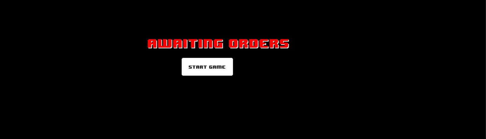
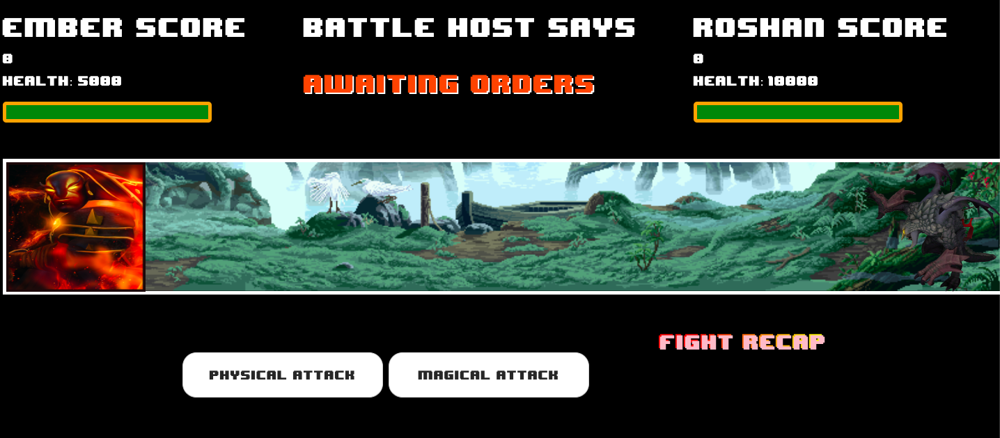
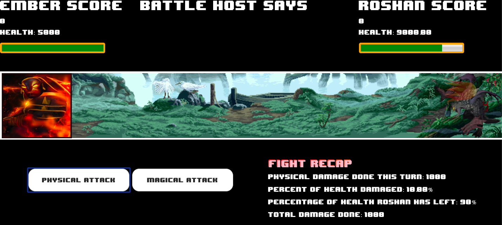

# Dota2Fighting is a turn based game where the objective of the game is to outlast the computer and have more health points remaining.

## Ember(user) begins with 4000 health points and Roshan(computer) starts with 10000 health points.
### This game is played by the user selecting the order of one of two options:
    1. The user can select either Physical Attack for a consistent 800 damage to Roshan
        or Magical Attack damage that has a variable rate between 0-2000.
    2.Roshan has similar abilities that the user will not see but will conduct its damage by attacking you once with its
        physical attack that does a consistent $400 and then a Magi attack damage that has a variable rate of damage as well ranging between 0-800.
    
# Technologies used:
    - HTML
    - CSS
    - Javascript

# Planned improvements:
    1. Making this a 3 hero team.
    2. Adding a 3rd button to create more varaince during rounds.
    3. Reimaging and adding more animations sounds.
    4. Possibly making this a dynamic game that is controlled by keyboard event listeners vs. click event listeners.